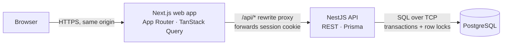
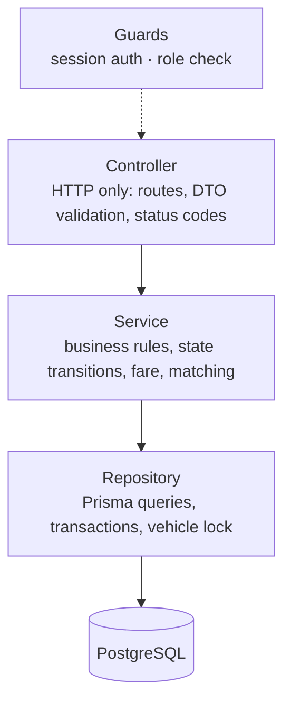
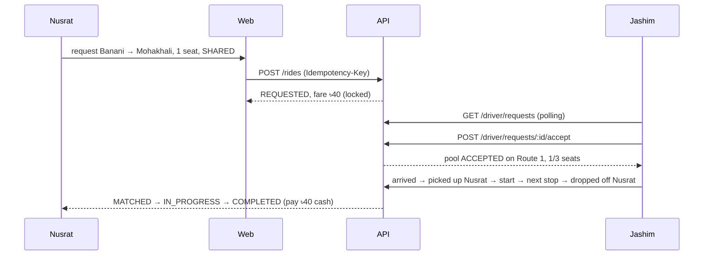
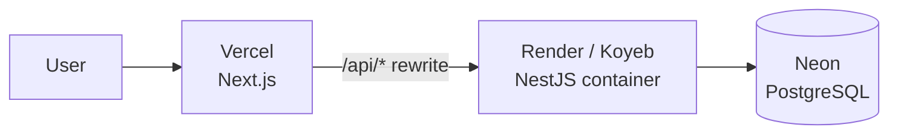

# Architecture

Dhaka Tesla Pool is a ride-pooling MVP: passengers request rides, drivers accept them, and several
passengers can share one vehicle without ever exceeding its seats.

## System overview



| Component | Responsibility |
|---|---|
| **Browser** | Renders the UI; holds the session cookie (httpOnly, never readable by JavaScript). |
| **Next.js web** | Passenger and driver screens; polls the API for live status; proxies `/api/*` to the API so the browser only ever talks to one origin. |
| **NestJS API** | Authentication, validation, business rules, ride and pool state transitions, capacity enforcement, logging. |
| **PostgreSQL** | Source of truth; enforces invariants with CHECK constraints, partial unique indexes and row locks. |

**Why a same-origin proxy:** in production the web app and the API run on different hosts. Browsers
increasingly block cross-site cookies, so Next.js rewrites `/api/*` to the API. The session cookie stays
first-party and no CORS configuration is needed.

**Deliberately not included:** microservices, message queues, Redis, WebSockets. PostgreSQL row locks
and constraints solve the MVP's consistency problems; polling is enough for live status. What changes at larger scale is
covered in the scaling notes (planned: `docs/scaling.md`).

## API layers



- **Controller** knows HTTP. It maps domain errors to status codes.
- **Service** knows the rules and never imports HTTP types. It raises domain errors such as `SeatsUnavailable` or `InvalidTransition`.
- **Repository** is the only layer that talks to the database. `withVehicleLock(vehicleId, fn)` is the only way to change pools and memberships.
- A lower layer never imports an upper one.

Modules: `auth`, `users`, `vehicles`, `geography` (areas, routes), `fares`, `rides` (requests), `pools`, `health`.

## Consistency model: "one vehicle = one line"

Every operation that changes a vehicle's seats or its pool runs in one database transaction that
starts by locking the vehicle row.

```mermaid
sequenceDiagram
    participant R as Rafiq (join)
    participant S as Shirin (join)
    participant DB as PostgreSQL
    R->>DB: BEGIN; SELECT vehicle FOR UPDATE
    S->>DB: BEGIN; SELECT vehicle FOR UPDATE
    Note over S,DB: waits for Rafiq's lock
    R->>DB: release expired holds; check seats (1 free)
    R->>DB: UPDATE pools SET seats_taken += 1 WHERE status joinable
    R->>DB: INSERT pool_member, INSERT event; COMMIT
    DB-->>S: lock granted
    S->>DB: check seats (0 free) → SeatsUnavailable
    S->>DB: ROLLBACK
```

Inside the lock, every time: release expired holds → check state, route, seats → decide → write the
change and its history event together.

Guarantees enforced by the database, independent of application code:

| Invariant | Enforcement |
|---|---|
| Seats never exceed capacity | `CHECK (seats_taken BETWEEN 0 AND seat_capacity)` on `pools` |
| One active pool per vehicle | partial unique index on `pools(vehicle_id)` |
| One active membership per request | partial unique index on `pool_members(ride_request_id)` |
| One active request per passenger | partial unique index on `ride_requests(passenger_id)` |
| No duplicate booking on retry | unique `ride_requests(passenger_id, idempotency_key)` |
| No join after the pool is finished | conditional seat update checks pool status |

Transactions use READ COMMITTED with a `lock_timeout`, stay short, and make no network calls
while holding a lock.

## Request lifecycle (happy path)



## Geography and fare

- Areas and routes are data in the database (seeded), not an external map API. Adjacent stops on a route are 2 km apart (one hop).
- Fare = ৳30 base + ৳20 × hops, minus 20% for SHARED rides. It is calculated and locked when the request is created, and stored in integer paisa.

## Deployment



All free tiers. Locally, `docker compose up` runs web, API, PostgreSQL and a test database.
