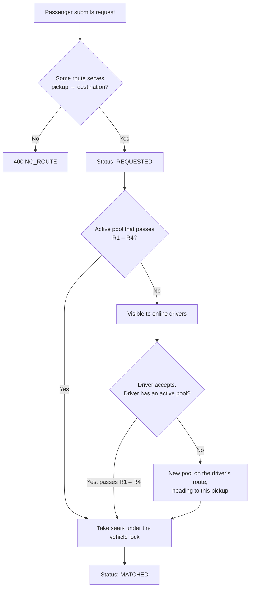
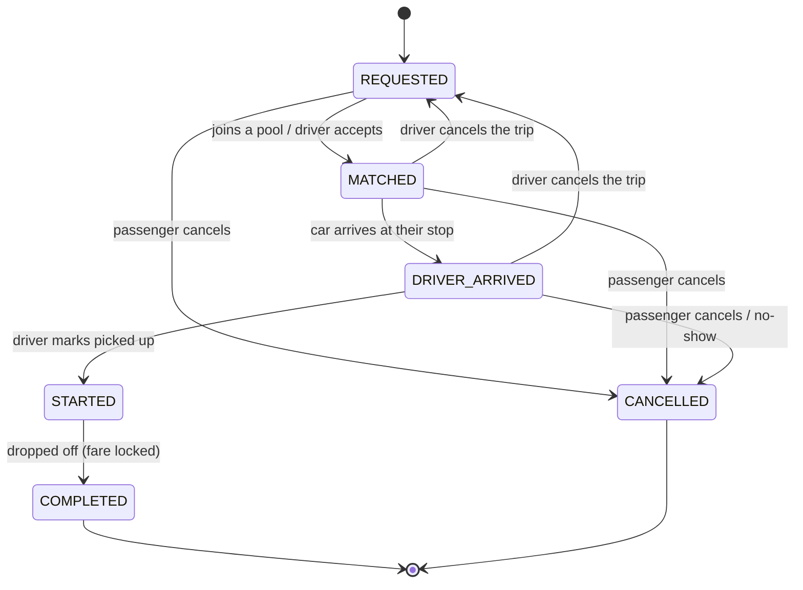

# Assumptions & Business Rules

| | |
|---|---|
| **Document** | Assumptions & Business Rules |
| **Project** | Dhaka Tesla Pool — MVP |
| **Related** | [System overview](system-overview.pdf) · [Ride flow](ride-flow.pdf) · [Decisions](../decisions.md) |

---

## Contents

1. [Purpose & Scope](#1-purpose--scope)
2. [Glossary](#2-glossary)
3. [Geography and Routes](#3-geography)
4. [Matching Rules](#4-matching-rules)
5. [Ride Lifecycle](#5-ride-lifecycle)
6. [Cancellation Rules](#6-cancellation-rules)
7. [Fare & Payment](#7-fare--payment)
8. [Users, Vehicles & Access](#8-users-vehicles--access)
9. [Technical Assumptions](#9-technical-assumptions)
10. [Story Cast & Seed Data](#10-story-cast--seed-data)
11. [Assumption Register](#11-assumption-register)

---

## 1. Purpose & Scope

The product brief leaves several rules intentionally open and asks the team to make reasonable assumptions, document them, and apply them consistently. This document is the single source of truth for those decisions.

Every rule here is implemented in the backend, covered by tests where it carries risk, and reflected in the seed data and demo. If the implementation changes, this document changes with it.

**Out of scope for the MVP:** real-time GPS, turn-by-turn routing, surge pricing, ratings, real payment gateways, multi-city support.

---

## 2. Glossary

| Term | Meaning |
|---|---|
| **Zone** | A predefined area of Dhaka. Every trip starts and ends in a zone. |
| **Ride request** | One passenger's request for a trip: pickup zone, destination zone, seat count. |
| **Route** | A fixed line of zones a Tesla drives in one direction, e.g. Uttara → Banani → Mohakhali → Gulshan 1 → Gulshan 2 → Bashundhara. |
| **Stop** | One zone on a route. Its **position** (0, 1, 2 …) is its place in driving order. |
| **Hop** | The stretch between two neighbouring stops. |
| **Pool** | One trip of one driver's vehicle along its route, carrying one or more ride requests. |
| **Current stop** | The stop the vehicle is standing at, or driving to. |
| **Pool member** | A ride request that holds seats in a pool, from its pickup stop to its drop-off stop. |
| **Direct distance** | The distance from pickup to a passenger's own destination, from the distance table. It sets the fare. |
| **Paisa** | 1/100 of a Bangladeshi taka (৳). All money is stored in paisa. |

---

## 3. Geography

### 3.1 Zones

The MVP does not use a map API or real routing, as the brief recommends. Dhaka is modelled as a fixed list of 14 zones.

| Code | Zone | Code | Zone |
|---|---|---|---|
| `UTT` | Uttara | `FRM` | Farmgate |
| `BSH` | Bashundhara | `MR1` | Mirpur 1 |
| `BAN` | Banani | `MR2` | Mirpur 2 |
| `GL1` | Gulshan 1 | `M10` | Mirpur 10 |
| `GL2` | Gulshan 2 | `M11` | Mirpur 11 |
| `MOH` | Mohakhali | `M12` | Mirpur 12 |
| `TEJ` | Tejgaon | `DHN` | Dhanmondi |

**Rules**
- Pickup and destination must be different zones.
- A street-level address (e.g. "Banani Road 11") may be added as a free-text note for the driver. It does not affect matching or fare.

### 3.2 Distance Table (km)

Approximate road distances, rounded to whole kilometres and stored in the seed data.

|         | UTT | BSH | BAN | GL1 | GL2 | MOH | TEJ | FRM | MR1 | MR2 | M10 | M11 | M12 | DHN |
|---------|---:|---:|---:|---:|---:|---:|---:|---:|---:|---:|---:|---:|---:|---:|
| **UTT** | – | 9 | 12 | 14 | 12 | 13 | 15 | 16 | 14 | 13 | 12 | 10 | 9 | 19 |
| **BSH** | 9 | – | 6 | 5 | 4 | 7 | 9 | 11 | 14 | 13 | 12 | 12 | 12 | 14 |
| **BAN** | 12 | 6 | – | 4 | 3 | 3 | 6 | 7 | 10 | 9 | 8 | 9 | 10 | 10 |
| **GL1** | 14 | 5 | 4 | – | 2 | 3 | 5 | 7 | 11 | 11 | 10 | 11 | 12 | 10 |
| **GL2** | 12 | 4 | 3 | 2 | – | 4 | 6 | 8 | 12 | 11 | 10 | 10 | 11 | 11 |
| **MOH** | 13 | 7 | 3 | 3 | 4 | – | 3 | 4 | 8 | 8 | 7 | 8 | 9 | 7 |
| **TEJ** | 15 | 9 | 6 | 5 | 6 | 3 | – | 2 | 8 | 8 | 7 | 8 | 9 | 5 |
| **FRM** | 16 | 11 | 7 | 7 | 8 | 4 | 2 | – | 7 | 7 | 6 | 7 | 8 | 3 |
| **MR1** | 14 | 14 | 10 | 11 | 12 | 8 | 8 | 7 | – | 2 | 3 | 4 | 5 | 7 |
| **MR2** | 13 | 13 | 9 | 11 | 11 | 8 | 8 | 7 | 2 | – | 2 | 3 | 4 | 8 |
| **M10** | 12 | 12 | 8 | 10 | 10 | 7 | 7 | 6 | 3 | 2 | – | 2 | 3 | 8 |
| **M11** | 10 | 12 | 9 | 11 | 10 | 8 | 8 | 7 | 4 | 3 | 2 | – | 2 | 9 |
| **M12** | 9 | 12 | 10 | 12 | 11 | 9 | 9 | 8 | 5 | 4 | 3 | 2 | – | 10 |
| **DHN** | 19 | 14 | 10 | 10 | 11 | 7 | 5 | 3 | 7 | 8 | 8 | 9 | 10 | – |

**Properties guaranteed by the table**

| Property | Why it matters |
|---|---|
| **Whole kilometres** | Every fare works out to whole taka and can be checked by hand. |
| **Symmetric** (A → B = B → A) | Direction never changes the price. |
| **Triangle inequality** (A → C ≤ A → B + B → C) | Going through a stop is never shorter than going direct. Verified for all 2,184 zone triples. |

### 3.3 Routes

Tesla Pool drives **three fixed lines**, each in both directions, so there are **six routes**. A driver picks one route before going online and keeps it for the whole trip. Seeded in `api/src/geography/dhaka-routes.ts`.

| Line | Stops in driving order (and back) |
|---|---|
| Airport Road | Uttara → Banani → Mohakhali → Gulshan 1 → Gulshan 2 → Bashundhara |
| Mirpur | Uttara → Mirpur 12 → Mirpur 11 → Mirpur 10 → Mirpur 2 → Mirpur 1 → Farmgate → Dhanmondi |
| Tejgaon | Banani → Mohakhali → Tejgaon → Farmgate → Dhanmondi |

**Rules**
- Every zone is on at least one route.
- A ride can be requested only if some route passes the pickup **and then** the destination, **without going too far round**: riding the route may add at most **2 km, or 40%**, to the direct distance, whichever allows more. Anything else is refused with `400 NO_ROUTE`, and the web app only offers these destinations (`GET /zones/:id/destinations`).
- Example: Rafiq's Banani → Mohakhali → Gulshan 1 is 6 km for a 4 km trip (+2 km, allowed); Uttara → Bashundhara on Airport Road is 24 km for 9 km (not sold). 72 of the 102 zone pairs a route passes are sold.
- Routes decide **who can share a car**. They do not change the price: each passenger pays for their own direct distance (§7).

---

## 4. Matching Rules

### 4.1 Eligibility

A ride request may join a pool only when **all four** conditions hold. They are pure functions in `api/src/pooling/route-plan.ts` and are checked again under the vehicle lock.

| # | Condition | Check |
|---|---|---|
| R1 | **On the route, in its direction, not too far round** | the route has the pickup and the drop-off, `pickupStop < dropoffStop`, and route km ≤ direct km + 2 or ≤ 140% of it |
| R2 | **The car has not passed the pickup** | `pickupStop ≥ pool.currentStop` |
| R3 | **Seats available** | `pool.seatsTaken + request.seats ≤ pool.seatCapacity` |
| R4 | **Pool is active** | `pool.status ∈ {MATCHED, DRIVER_ARRIVED, STARTED}` and the driver is online |

This is **en-route pooling**: a Tesla that is already on its way keeps picking people up at the stops ahead until its seats are full. Seats are freed when a passenger is dropped off, so a car that is full at Banani can take someone new at Mohakhali after a passenger gets off there.

### 4.2 Worked Examples (route Uttara → Bashundhara)

| Case | Trip | Result |
|---|---|---|
| Nusrat, first | Banani → Mohakhali | Jashim accepts; the trip starts on his route, heading to Banani |
| Rafiq | Banani → Gulshan 1 | Same route ahead → joins at once |
| Shirin, while Bullet drives Banani → Mohakhali | Mohakhali → Bashundhara | Mohakhali is ahead → joins on the way |
| Anyone, after Bullet left Banani | Banani → Gulshan 1 | R2 fails: "The car has already passed Banani" |
| Anyone | Banani → Uttara | R1 fails: the opposite direction |

### 4.3 Matching Flow



### 4.4 Automatic Join and Driver Accept

- **Where the car is:** on a trip, the pool's current stop; between trips, the stop of `vehicles.current_zone` on the chosen route. **Approach km** is the route distance from that stop to the pickup, only for pickups at or ahead of the car.
- **Automatic join:** a new request joins the **nearest** active pool that passes R1 – R4 (fewest approach km; on a tie, the older trip). A car that does not fit under its lock (full, passed) is skipped for the next nearest; if a vehicle is busy (lock wait over 3 s), or none fits, the request keeps waiting. Only cars already on a trip are considered.
- **Driver accept:** a driver with no active pool starts one **at the car's own stop**, and the car drives stop by stop to the pickup. A pickup behind the car is refused ("Behind your car"), as is a car that is not on the route; a route must also pass the car's zone to be chosen. A driver with an active pool can accept only requests that pass R1 – R4.
- **Broadcast, first accept wins:** a request that fits no running trip is shown to every driver whose car can take it, and only to them; the first accept gets it (compare-and-set on the request), and the late one is told "Another driver took this request". It leaves every other list at once over Server-Sent Events (decision D-020).
- **A freed seat is filled at once:** after a cancel, a no-show or a drop-off, the same transaction seats waiting riders who fit, in the waiting-list order below (decision D-017). No driver tap, no seat hold.
- **Waiting list order:** takeable requests waiting 5 minutes or more first (oldest first, so no one waits for ever), then the other takeable ones by nearest pickup, then the ones the driver cannot take, each with its reason. Every item shows how far ahead its pickup is.

### 4.5 Constraints

| Rule | Reason |
|---|---|
| A driver has at most **one active pool**, and changes route only between trips. | One vehicle can only be in one place. |
| A passenger has at most **one active request**. | Prevents double-booking the same person. |
| A driver must pick a route before going online, and cannot go offline with an active pool. | Passengers must not be abandoned mid-trip. |

### 4.6 Route Suggestion

The system suggests a route and the driver decides (`api/src/pooling/route-suggestion.ts`).

| Step | Rule |
|---|---|
| Where the car is | `vehicles.current_zone`: set by the driver before the first trip, then updated automatically at every **Arrive**. It cannot be set by hand during a trip. |
| Demand per route | Waiting requests the route could still serve from the car's zone: the route passes their pickup, then their destination, and the pickup is at or after the car. |
| Listed | Only the routes through the car's zone (a trip starts where the car is, D-014); none until the location is set. Each shows how many riders wait ahead of the car on it (decision D-019). |
| Moving off the route | Setting a location the chosen route does not pass clears the route and sets the driver offline until they pick a listed one. |
| Ranking | Most riders waiting, then route code. |
| Suggestion | The best route through the car's zone, shown as **Suggested** with one tap to take it. No suggestion while the location is unknown. |

Example: Jashim at Banani; Nusrat Banani → Dhanmondi and Rafiq Mohakhali → Farmgate wait on Banani → Dhanmondi, Shirin Banani → Gulshan 1 on Uttara → Bashundhara, so Banani → Dhanmondi is suggested (2 waiting). At scale this becomes automatic dispatch from GPS and demand; it is kept as advice here because there is no live location and the driver must agree to a route.

---

## 5. Ride Lifecycle

### 5.1 Passenger States

Each passenger moves on their own: people get on and off at different stops.



### 5.2 Pool States: Where the Car Is

The pool's status and `current_stop` together say where the vehicle is.

| Status | Meaning |
|---|---|
| `MATCHED` | Heading to the first pickup |
| `DRIVER_ARRIVED` | Standing at the current stop |
| `STARTED` | Driving to the current stop |
| `COMPLETED` | Everyone was dropped off |
| `CANCELLED` | Ended before anyone was picked up |

### 5.3 Driver Actions

| Action | From → to | Precondition |
|---|---|---|
| **Arrive** | pool `MATCHED`/`STARTED` → `DRIVER_ARRIVED`; passengers waiting at this stop → `DRIVER_ARRIVED` | Not already at a stop |
| **Picked up** | passenger `DRIVER_ARRIVED` → `STARTED` | The car is at their stop |
| **No-show** | passenger `DRIVER_ARRIVED` → `CANCELLED`, seats freed | The car is at their stop |
| **Drop off** | passenger `STARTED` → `COMPLETED`, **fare locked**, seats freed | The car is at their drop-off stop |
| **Leave for next stop** | pool `DRIVER_ARRIVED` → `STARTED`, `current_stop + 1` | Nobody left to pick up or drop off here |
| **Cancel trip** | members → `REQUESTED`, pool → `CANCELLED` | Nobody has been picked up yet |

When the last passenger leaves the pool, it closes by itself: `COMPLETED` if anyone was carried, otherwise `CANCELLED`. Any other order is rejected with **`409 INVALID_TRANSITION`**.

### 5.4 Deviation from the Brief

The brief suggests `MATCHED/ACCEPTED` as a single step. This design keeps one state, `MATCHED`, because "a driver accepted the request" and "the request joined a pool" have the same outcome: the passenger holds a seat in a specific vehicle. `STARTED` means "in the car" for a passenger and "driving between stops" for the pool.

### 5.5 Audit Trail

Every passenger status change is recorded in `ride_events` with the ride, the pool, previous status, new status, actor, reason (e.g. "Picked up at Banani") and timestamp. Any past ride can be reconstructed from it.

---

## 6. Cancellation Rules

### 6.1 Passenger Cancellation

| Rule | Detail |
|---|---|
| **When** | `REQUESTED`, `MATCHED` or `DRIVER_ARRIVED`, i.e. until picked up. Not allowed once in the car. |
| **Who** | Only the passenger who owns the ride. Anyone else receives `403 Forbidden`. |
| **Seats** | Released immediately, in the same transaction. |
| **Empty pool** | If nobody is left, the pool closes and the driver becomes free. |
| **Twice** | Cancelling a ride that is already cancelled returns it as it is (a double tap or a retry is not an error). After pickup: `409` "A ride cannot be cancelled after pickup"; after drop-off: `409` "This ride is already finished". |
| **At the same moment as the driver** | Accept, pickup, no-show and trip cancel all run under the same vehicle lock, so exactly one wins and the other is told why (e.g. the driver sees "The passenger cancelled this request"). Decision D-016. |
| **Fee** | **৳20** once the car is coming straight to the passenger's stop (the driver has left for it) or is standing there, unless the seat was taken less than 2 minutes ago. A no-show costs the same. Free while waiting or while the car is a stop or more away. The driver who came earns all of it (decision D-018). |
| **Paying the fee** | Cash only, so it is paid with the passenger's next ride: shown on that ride ("+ ৳20 from an earlier late cancel"), collected by that driver at drop-off and handed to the platform, which pays the first driver. |

### 6.2 Effect on Other Passengers' Fares

Fares are locked at drop-off. If Rafiq cancels before being picked up, Nusrat rides alone and pays the solo fare of **৳75** instead of ৳60. Her estimate already showed ৳75, so a passenger **never pays more than the estimate** they saw.

### 6.3 Driver Cancellation and No-shows

| Rule | Detail |
|---|---|
| **Cancel trip** | Before the first pickup only (e.g. a breakdown). All members return to `REQUESTED`, not `CANCELLED`, with no fee, and are offered again at once, oldest request first: a running car that fits seats them, otherwise idle cars that can take them see them (decision D-021). |
| **No-show** | At the passenger's stop, the driver can mark them as not there: the ride is `CANCELLED` and the seat is freed. |
| **Audit** | The reason is recorded in the history. |

---

## 7. Fare & Payment

Implemented in `api/src/fares/fare.ts` and `api/src/pooling/route-plan.ts`; the hand-calculations below are unit tests.

```
subtotal      = (baseFare + distanceKm × perKmRate) × seats
poolDiscount  = subtotal × 20%   — only if another passenger rode with you on at least one hop
passengerFare = subtotal − poolDiscount
```

| Parameter | Value | Stored as (paisa) |
|---|---:|---:|
| Base fare | ৳30 | 3000 |
| Per-km rate | ৳15 | 1500 |
| Pool discount | 20% | — |

| Rule | Detail |
|---|---|
| **Money storage** | Integer paisa. No floating-point arithmetic anywhere in the fare path. |
| **Distance charged** | Each passenger pays for their own **direct** distance, never the route's detour. |
| **Sharing rule** | Two passengers share if their stretches overlap on at least one hop: `a.pickup < b.dropoff` and `b.pickup < a.dropoff`. Getting on at the stop where someone else gets off is not sharing. Cancelled riders and no-shows never count. |
| **Estimate** | Shown at request time using the solo fare, the maximum the passenger can pay. |
| **Final fare** | Calculated and locked when the passenger is **dropped off**, when it is known who they rode with. |
| **Payment** | Cash only: the passenger pays the final fare to the driver at drop-off, plus any ৳20 late-cancel fee still owed from an earlier ride (§6.1). A simulated TeslaPay wallet is a future improvement. |

**Worked examples**

| Passenger | Trip | Solo | Shared a hop with | Final |
|---|---|---:|---|---:|
| Nusrat | Banani → Mohakhali, 3 km | ৳75 | Rafiq (Banani → Mohakhali) | **৳60** |
| Rafiq | Banani → Gulshan 1, 4 km | ৳90 | Nusrat, Shirin | **৳72** |
| Shirin | Mohakhali → Bashundhara, 7 km | ৳135 | Rafiq (Mohakhali → Gulshan 1) | **৳108** |
| Nusrat alone | Banani → Mohakhali | ৳75 | nobody | **৳75** |

### 7.2 Who Gets What: Passenger, Driver, Platform

The three parties are paid separately (`api/src/fares/earnings.ts`, decision D-010). The discount is paid for by the extra passengers, never by the driver.

| Party | Rule |
|---|---|
| **Passenger pays** | The fare above, in cash to the driver at drop-off. |
| **Driver earns** | **৳10 per km** the car drives with at least one passenger on board (each hop counted once) **+ ৳20 per passenger picked up**. It does not depend on fares or discounts. |
| **Platform keeps** | Collected fares − driver earnings: a fee the driver owes, as with cash rides on ride-hailing apps. |

| Trip | Collected | Driver | Platform |
|---|---:|---:|---:|
| Nusrat alone (3 km, 1 pickup) | ৳75 | ৳50 | ৳25 |
| Nusrat + Rafiq (6 km carried, 2 pickups) | ৳132 | ৳100 | ৳32 |
| Nusrat, Rafiq, Shirin (12 km carried, 3 pickups) | ৳240 | ৳180 | ৳60 |

**Guarantee:** a unit test runs every trip the six routes can sell, alone and in every group of up to three bookings. The platform keeps at least ৳10 in every case (about 25,000 cases). The split is locked when the trip completes, and the database checks that `collected = driver + platform`.

---

## 8. Users, Vehicles & Access

| Rule | Detail |
|---|---|
| **Roles** | Each account has exactly one role: `PASSENGER` or `DRIVER`, chosen first on the login and sign-up pages. Login checks the chosen type against the account. |
| **Sign-up details** | Everyone: full name, email, a Bangladeshi mobile number (stored as `+8801XXXXXXXXX`), password (8+ characters), present and permanent address. Drivers also: an NID (10, 13 or 17 digits) **or** a passport (1–2 letters + 7–8 digits), a driving licence number, and their car's name and number plate. |
| **One person, one account** | Email, phone, identity document, licence and plate are each unique. A driver's user, documents and car are saved together or not at all. |
| **Not verified yet** | Phones are not verified by OTP and documents are not checked by a person; a new driver can drive at once. Both are planned (decision D-015). |
| **Vehicles** | A driver owns exactly one vehicle, created at sign-up with 3 seats and no route or location yet. Bullet's capacity is 3. |
| **Seats per request** | 1 to 3, never more than the vehicle's capacity. |
| **Visibility** | A passenger sees only their own rides and fares, plus where the car is on the route. A driver sees only the members of their own pools. |
| **Pool members** | Passengers in the same pool see each other's first name only, never fares. |

---

## 9. Technical Assumptions

| Area | Assumption | Reason |
|---|---|---|
| **Live updates** | Server-Sent Events: after every committed action the API sends a data-free hint and screens refetch their own data (under 0.1 s); polling at 3 s (histories 10 s) only while the stream is down (decision D-020). | Simple and reliable on free hosting, and correctness never depends on it (every action is re-checked under the lock). At scale: adaptive polling, then WebSockets or SSE (see D-007). |
| **Concurrency** | Every seat or stop change locks the vehicle row inside a transaction, backed by database `CHECK` constraints. | Two passengers racing for the last seat must never both succeed, and the car can never leave a stop while someone is joining there. |
| **Time zone** | Timestamps are stored in UTC and shown in Asia/Dhaka (UTC+6). | Avoids ambiguity in history and tests. |
| **Language** | The UI is in English. | Keeps the MVP scope small; Bangla is a future improvement. |

---

## 10. Story Cast & Seed Data

The seed data, tests and demo use the cast from the brief throughout.

| Name | Role | Trip / Vehicle | Scenario |
|---|---|---|---|
| **Jashim** | Driver | Bullet, 3 seats, route Uttara → Bashundhara | Accepts and drives the trip stop by stop |
| **Nusrat** | Passenger | Banani → Mohakhali | First request; pooled fare ৳60 |
| **Rafiq** | Passenger | Banani → Gulshan 1 | Joins Nusrat's trip; pooled fare ৳72 |
| **Shirin** | Passenger | Mohakhali → Bashundhara | Joins Bullet on the way; races for the last seat |

---

## 11. Assumption Register

| ID | Assumption | Section |
|---|---|---|
| A-01 | Dhaka is modelled as 14 fixed zones; no map API or routing. | [3.1](#31-zones) |
| A-02 | Distances are fixed, symmetric, whole kilometres. | [3.2](#32-distance-table-km) |
| A-03 | Tesla Pool drives six fixed routes (three lines, both directions); a ride needs a route that passes the pickup, then the destination. | [3.3](#33-routes) |
| A-04 | A passenger can join a Tesla already on its way if it has not passed their pickup (R1 – R4). | [4.1](#41-eligibility) |
| A-05 | Seats are freed at drop-off; the seat count covers everyone not yet dropped off. | [4.1](#41-eligibility) |
| A-06 | A request auto-joins the nearest compatible running trip; a new trip starts where the car is; the driver's list is nearest first with 5-minute aging. | [4.4](#44-automatic-join-and-driver-accept) |
| A-07 | One active pool per driver; one active request per passenger; the route changes only between trips. | [4.5](#45-constraints) |
| A-08 | `MATCHED` covers both "accepted" and "joined a pool". | [5.4](#54-deviation-from-the-brief) |
| A-09 | Every passenger status change is recorded in an audit table. | [5.5](#55-audit-trail) |
| A-10 | Passengers can cancel until picked up, with no fee; drivers can mark no-shows. | [6](#6-cancellation-rules) |
| A-11 | Driver cancellation (before the first pickup) returns passengers to `REQUESTED`. | [6.3](#63-driver-cancellation-and-no-shows) |
| A-12 | Fares are locked at drop-off; passengers never pay more than the estimate. | [7](#7-fare--payment) |
| A-13 | Money is stored as integer paisa. | [7](#7-fare--payment) |
| A-14 | The 20% discount applies when another passenger shared at least one hop; direct distance is charged. | [7](#7-fare--payment) |
| A-15 | Payment is cash only. | [7](#7-fare--payment) |
| A-18 | The system suggests a route from the car's zone and the waiting demand; the driver chooses. | [4.6](#46-route-suggestion) |
| A-19 | No seat hold: a fitting request takes its seat at once (auto-join); the driver does not confirm each join. | [4.4](#44-automatic-join-and-driver-accept) |
| A-20 | A route sells a trip only if it adds at most 2 km, or 40%, to the direct distance. | [3.3](#33-routes) |
| A-21 | The driver earns ৳10 per carried km + ৳20 per pickup; the platform keeps the rest of the fares. | [7.2](#72-who-gets-what-passenger-driver-platform) |
| A-16 | One role per account; one vehicle per driver. | [8](#8-users-vehicles--access) |
| A-17 | Live status via Server-Sent Events hints, with polling as a fallback; not WebSockets. | [9](#9-technical-assumptions) |
| A-22 | Both account types sign up on their own; drivers give an NID or passport, a licence and their car; no OTP or document check yet. | [8](#8-users-vehicles--access) |
| A-23 | A seat freed by a cancel, a no-show or a drop-off goes straight to a waiting rider who fits. | [4.4](#44-automatic-join-and-driver-accept) |
| A-24 | A late cancel or a no-show costs ৳20 (after a 2-minute grace), paid in cash with the next ride, earned by the driver who came. | [6.1](#61-passenger-cancellation) |
| A-25 | Idle drivers see only requests their car can take; the first accept wins; changes reach open screens over SSE. | [4.4](#44-automatic-join-and-driver-accept) |
