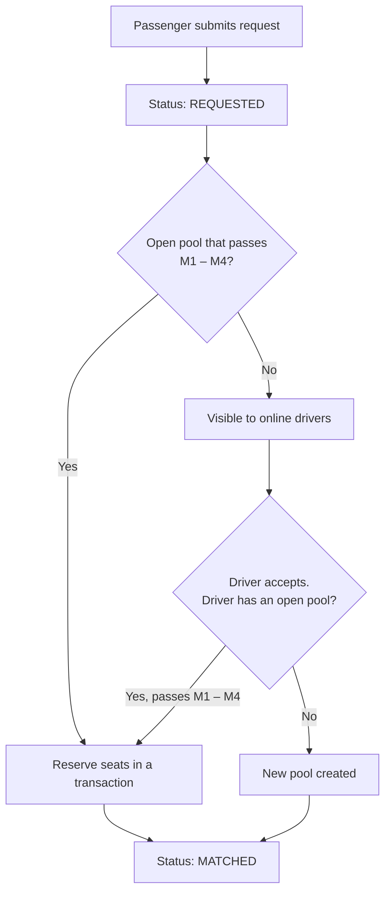
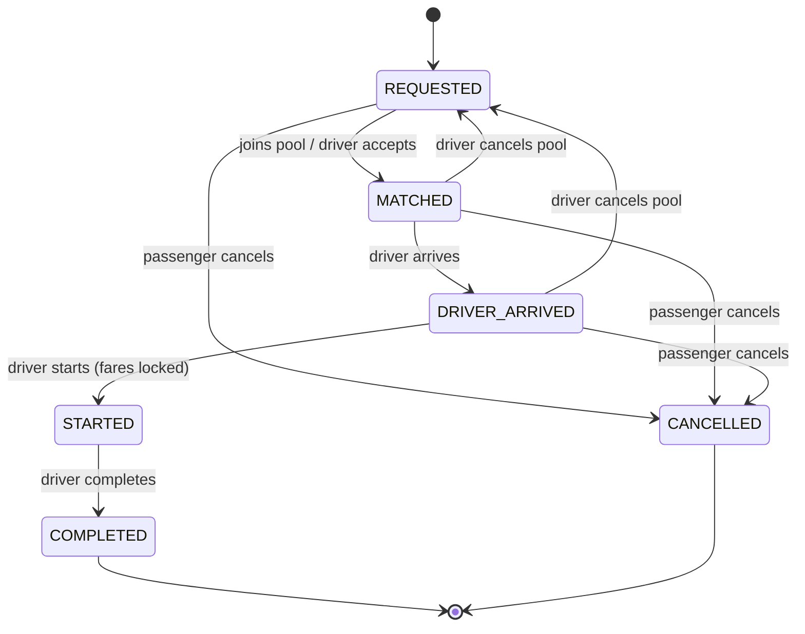

# Assumptions & Business Rules

| | |
|---|---|
| **Document** | Assumptions & Business Rules |
| **Project** | Dhaka Tesla Pool — MVP |
| **Related** | [Architecture](architecture.md) · [ERD](erd.md) · [State machines](state-machine.md) · [Decisions](../decisions.md) |

---

## Contents

1. [Purpose & Scope](#1-purpose--scope)
2. [Glossary](#2-glossary)
3. [Geography](#3-geography)
4. [Matching Rules](#4-matching-rules)
5. [Ride Lifecycle](#5-ride-lifecycle)
6. [Cancellation Rules](#6-cancellation-rules)
7. [Fare & Payment](#7-fare--payment)
8. [Users, Vehicles & Access](#8-users-vehicles--access)
9. [Technical Assumptions](#9-technical-assumptions)
10. [Story Cast & Seed Data](#10-story-cast--seed-data)
11. [Assumption Register](#11-assumption-register)

---

## 1. Purpose & Scope

The product brief leaves several rules intentionally open and asks the team to make reasonable assumptions, document them, and apply them consistently. This document is the single source of truth for those decisions.

Every rule here is implemented in the backend, covered by tests where it carries risk, and reflected in the seed data and demo. If the implementation changes, this document changes with it.

**Out of scope for the MVP:** real-time GPS, turn-by-turn routing, surge pricing, ratings, real payment gateways, multi-city support.

---

## 2. Glossary

| Term | Meaning |
|---|---|
| **Zone** | A predefined area of Dhaka. Every trip starts and ends in a zone. |
| **Ride request** | One passenger's request for a trip: pickup zone, destination zone, seat count. |
| **Pool** | A single trip by one driver's vehicle, carrying one or more ride requests. |
| **Pool member** | A ride request that has been assigned a seat in a pool. |
| **Direct distance** | The distance from pickup to a passenger's own destination, from the distance table. |
| **In-car distance** | The distance a passenger actually travels, given the pool's drop-off order. |
| **Detour** | In-car distance − direct distance. |
| **Open pool** | A pool in `MATCHED` status that can still accept members. |
| **Paisa** | 1/100 of a Bangladeshi taka (৳). All money is stored in paisa. |

---

## 3. Geography

### 3.1 Zones

The MVP does not use a map API or real routing, as the brief recommends. Dhaka is modelled as a fixed list of 14 zones.

| Code | Zone | Code | Zone |
|---|---|---|---|
| `UTT` | Uttara | `FRM` | Farmgate |
| `BSH` | Bashundhara | `MR1` | Mirpur 1 |
| `BAN` | Banani | `MR2` | Mirpur 2 |
| `GL1` | Gulshan 1 | `M10` | Mirpur 10 |
| `GL2` | Gulshan 2 | `M11` | Mirpur 11 |
| `MOH` | Mohakhali | `M12` | Mirpur 12 |
| `TEJ` | Tejgaon | `DHN` | Dhanmondi |

**Rules**
- Pickup and destination must be different zones.
- A street-level address (e.g. "Banani Road 11") may be added as a free-text note for the driver. It does not affect matching or fare.

### 3.2 Distance Table (km)

Approximate road distances, rounded to whole kilometres and stored in the seed data.

|         | UTT | BSH | BAN | GL1 | GL2 | MOH | TEJ | FRM | MR1 | MR2 | M10 | M11 | M12 | DHN |
|---------|---:|---:|---:|---:|---:|---:|---:|---:|---:|---:|---:|---:|---:|---:|
| **UTT** | – | 9 | 12 | 14 | 12 | 13 | 15 | 16 | 14 | 13 | 12 | 10 | 9 | 19 |
| **BSH** | 9 | – | 6 | 5 | 4 | 7 | 9 | 11 | 14 | 13 | 12 | 12 | 12 | 14 |
| **BAN** | 12 | 6 | – | 4 | 3 | 3 | 6 | 7 | 10 | 9 | 8 | 9 | 10 | 10 |
| **GL1** | 14 | 5 | 4 | – | 2 | 3 | 5 | 7 | 11 | 11 | 10 | 11 | 12 | 10 |
| **GL2** | 12 | 4 | 3 | 2 | – | 4 | 6 | 8 | 12 | 11 | 10 | 10 | 11 | 11 |
| **MOH** | 13 | 7 | 3 | 3 | 4 | – | 3 | 4 | 8 | 8 | 7 | 8 | 9 | 7 |
| **TEJ** | 15 | 9 | 6 | 5 | 6 | 3 | – | 2 | 8 | 8 | 7 | 8 | 9 | 5 |
| **FRM** | 16 | 11 | 7 | 7 | 8 | 4 | 2 | – | 7 | 7 | 6 | 7 | 8 | 3 |
| **MR1** | 14 | 14 | 10 | 11 | 12 | 8 | 8 | 7 | – | 2 | 3 | 4 | 5 | 7 |
| **MR2** | 13 | 13 | 9 | 11 | 11 | 8 | 8 | 7 | 2 | – | 2 | 3 | 4 | 8 |
| **M10** | 12 | 12 | 8 | 10 | 10 | 7 | 7 | 6 | 3 | 2 | – | 2 | 3 | 8 |
| **M11** | 10 | 12 | 9 | 11 | 10 | 8 | 8 | 7 | 4 | 3 | 2 | – | 2 | 9 |
| **M12** | 9 | 12 | 10 | 12 | 11 | 9 | 9 | 8 | 5 | 4 | 3 | 2 | – | 10 |
| **DHN** | 19 | 14 | 10 | 10 | 11 | 7 | 5 | 3 | 7 | 8 | 8 | 9 | 10 | – |

**Properties guaranteed by the table**

| Property | Why it matters |
|---|---|
| **Whole kilometres** | Every fare works out to whole taka and can be checked by hand. |
| **Symmetric** (A → B = B → A) | Direction never changes the price. |
| **Triangle inequality** (A → C ≤ A → B + B → C) | A detour can never be negative. Verified for all 2,184 zone triples. |

---

## 4. Matching Rules

### 4.1 Eligibility

A ride request may join an existing pool only when **all four** conditions hold:

| # | Condition | Check |
|---|---|---|
| M1 | **Same pickup zone** | `request.pickupZone = pool.pickupZone` |
| M2 | **Pool is open** | `pool.status = MATCHED` |
| M3 | **Seats available** | `pool.occupiedSeats + request.seats ≤ vehicle.capacity` |
| M4 | **Detour limit** | Every member's detour, including the new one, is **≤ 2 km** |

### 4.2 Detour Calculation

1. Order drop-offs **nearest-first** by each member's direct distance from the pickup zone. Ties go to the earlier request.
2. A member's **in-car distance** is the sum of route legs from pickup to their drop-off.
3. **Detour = in-car distance − direct distance.**

### 4.3 Worked Examples

**Nusrat + Rafiq — match**

| Passenger | Trip | Direct | Route | In-car | Detour |
|---|---|---:|---|---:|---:|
| Nusrat | Banani → Mohakhali | 3 km | BAN → MOH | 3 km | 0 km |
| Rafiq | Banani → Gulshan 1 | 4 km | BAN → MOH → GL1 (3 + 3) | 6 km | 2 km |

All conditions hold, so they share Bullet.

**Banani → Uttara joining Nusrat — no match**

Route BAN → MOH → UTT = 3 + 13 = 16 km against a direct 12 km: detour 4 km > 2 km. The request stays `REQUESTED` and waits for its own driver.

### 4.4 Matching Flow



- **Automatic join:** when several pools qualify, the request joins the one **created earliest**, so older pools fill first.
- **Driver accept:** a driver with no active pool creates a new one. A driver whose pool is still open can accept only requests that pass M1 – M4, and the request is added to that pool. This covers requests made *before* the pool existed, which the automatic join would never see.

### 4.5 Constraints

| Rule | Reason |
|---|---|
| A driver has at most **one active pool**. | One vehicle can only be in one place. |
| A passenger has at most **one active request**. | Prevents double-booking the same person. |
| A driver cannot go offline with an active pool. | Passengers must not be abandoned mid-assignment. |

---

## 5. Ride Lifecycle

### 5.1 States

Both ride requests and pools carry a status. Driver actions change the pool's status, which is applied to every active member in the same transaction.



### 5.2 Allowed Transitions

| From | To | Actor | Precondition |
|---|---|---|---|
| `REQUESTED` | `MATCHED` | System / Driver | Joins an open pool, or a driver accepts it |
| `MATCHED` | `DRIVER_ARRIVED` | Driver | Pool belongs to this driver |
| `DRIVER_ARRIVED` | `STARTED` | Driver | Pool has ≥ 1 active member; **fares are locked** |
| `STARTED` | `COMPLETED` | Driver | — |
| `REQUESTED`, `MATCHED`, `DRIVER_ARRIVED` | `CANCELLED` | Passenger | Ride belongs to this passenger |
| `MATCHED`, `DRIVER_ARRIVED` | `REQUESTED` | Driver | Driver cancels the pool before start |

Any other transition is rejected with **`409 Conflict`**. `COMPLETED` and `CANCELLED` are terminal.

### 5.3 Deviation from the Brief

The brief suggests `MATCHED/ACCEPTED` as a single step. This design keeps one state, `MATCHED`, because "a driver accepted the request" and "the request joined an existing pool" have the same outcome: the passenger holds a seat in a specific vehicle.

### 5.4 Audit Trail

Every transition is recorded in a status history table with the ride, previous status, new status, actor, reason and timestamp. Any past ride can be reconstructed from it.

---

## 6. Cancellation Rules

### 6.1 Passenger Cancellation

| Rule | Detail |
|---|---|
| **When** | `REQUESTED`, `MATCHED` or `DRIVER_ARRIVED`. Not allowed once `STARTED`. |
| **Who** | Only the passenger who owns the ride. Anyone else receives `403 Forbidden`. |
| **Seats** | Released immediately, in the same transaction. |
| **Empty pool** | If no active members remain, the pool is cancelled and the driver becomes free. |
| **Fee** | None in the MVP. |

### 6.2 Effect on Other Passengers' Fares

Fares are locked only when the trip starts. If Rafiq cancels before the start, Nusrat rides alone and pays the solo fare of **৳75** instead of ৳60. Her estimate already showed ৳75, so a passenger **never pays more than the estimate** they saw.

### 6.3 Driver Cancellation

| Rule | Detail |
|---|---|
| **When** | Before `STARTED` only (e.g. vehicle breakdown). |
| **Effect** | All active members return to `REQUESTED`, not `CANCELLED`, so another driver can pick them up. |
| **Audit** | The reason is recorded in the status history. |

---

## 7. Fare & Payment

Implemented in `api/src/fares/fare.ts`; the hand-calculations below are unit tests in `api/src/fares/fare.spec.ts`.

```
subtotal      = (baseFare + distanceKm × perKmRate) × seats
poolDiscount  = subtotal × 20%        — only if the pool has 2+ passengers at STARTED
passengerFare = subtotal − poolDiscount
```

| Parameter | Value | Stored as (paisa) |
|---|---:|---:|
| Base fare | ৳30 | 3000 |
| Per-km rate | ৳15 | 1500 |
| Pool discount | 20% | 2000 basis points |

| Rule | Detail |
|---|---|
| **Money storage** | Integer paisa. No floating-point arithmetic anywhere in the fare path. |
| **Distance charged** | Each passenger pays for their own direct distance, never the detour. |
| **Pool discount basis** | Counts passengers, not seats. One passenger booking two seats alone gets no discount. |
| **Estimate** | Shown at request time using the solo fare, the maximum the passenger can pay. |
| **Final fare** | Calculated and locked when the trip starts. |
| **Payment** | Cash only; marked paid on `COMPLETED`. A simulated TeslaPay wallet is a future improvement. |

---

## 8. Users, Vehicles & Access

| Rule | Detail |
|---|---|
| **Roles** | Each account has exactly one role: `PASSENGER` or `DRIVER`. |
| **Vehicles** | A driver owns exactly one vehicle. Bullet's capacity is 3. |
| **Seats per request** | 1 to 3, never more than the vehicle's capacity. |
| **Visibility** | A passenger sees only their own rides and fares. A driver sees only the members of their own pools. |
| **Pool members** | Passengers in the same pool see each other's first name only, never fares. |

---

## 9. Technical Assumptions

| Area | Assumption | Reason |
|---|---|---|
| **Live updates** | Screens poll every 3–5 seconds. | Simple and reliable on free hosting; WebSockets are a future improvement. |
| **Concurrency** | Seat reservation locks the vehicle row inside a transaction, backed by a database `CHECK` constraint. | Two passengers racing for the last seat must never both succeed. |
| **Time zone** | Timestamps are stored in UTC and shown in Asia/Dhaka (UTC+6). | Avoids ambiguity in history and tests. |
| **Language** | The UI is in English. | Keeps the MVP scope small; Bangla is a future improvement. |

---

## 10. Story Cast & Seed Data

The seed data, tests and demo use the cast from the brief throughout.

| Name | Role | Trip / Vehicle | Scenario |
|---|---|---|---|
| **Jashim** | Driver | Bullet, 3 seats | Accepts and runs the pool |
| **Nusrat** | Passenger | Banani → Mohakhali | First request; pooled fare ৳60 |
| **Rafiq** | Passenger | Banani → Gulshan 1 | Joins Nusrat's pool; pooled fare ৳72 |
| **Shirin** | Passenger | Banani → Mohakhali | Races for the last seat |

---

## 11. Assumption Register

| ID | Assumption | Section |
|---|---|---|
| A-01 | Dhaka is modelled as 14 fixed zones; no map API or routing. | [3.1](#31-zones) |
| A-02 | Distances are fixed, symmetric, whole kilometres. | [3.2](#32-distance-table-km) |
| A-03 | Pool members share the same pickup zone. | [4.1](#41-eligibility) |
| A-04 | Maximum detour per passenger is 2 km. | [4.1](#41-eligibility) |
| A-05 | Drop-offs are ordered nearest-first. | [4.2](#42-detour-calculation) |
| A-06 | A request auto-joins the oldest open compatible pool; a driver can also add compatible waiting requests to their open pool. | [4.4](#44-matching-flow) |
| A-07 | One active pool per driver; one active request per passenger. | [4.5](#45-constraints) |
| A-08 | `MATCHED` covers both "accepted" and "joined a pool". | [5.3](#53-deviation-from-the-brief) |
| A-09 | Every status change is recorded in an audit table. | [5.4](#54-audit-trail) |
| A-10 | Passengers can cancel only before `STARTED`, with no fee. | [6.1](#61-passenger-cancellation) |
| A-11 | Driver cancellation returns passengers to `REQUESTED`. | [6.3](#63-driver-cancellation) |
| A-12 | Fares are locked at `STARTED`; passengers never pay more than the estimate. | [7](#7-fare--payment) |
| A-13 | Money is stored as integer paisa. | [7](#7-fare--payment) |
| A-14 | Pool discount is 20% and counts passengers, not seats. | [7](#7-fare--payment) |
| A-15 | Payment is cash only. | [7](#7-fare--payment) |
| A-16 | One role per account; one vehicle per driver. | [8](#8-users-vehicles--access) |
| A-17 | Live status via polling, not WebSockets. | [9](#9-technical-assumptions) |
