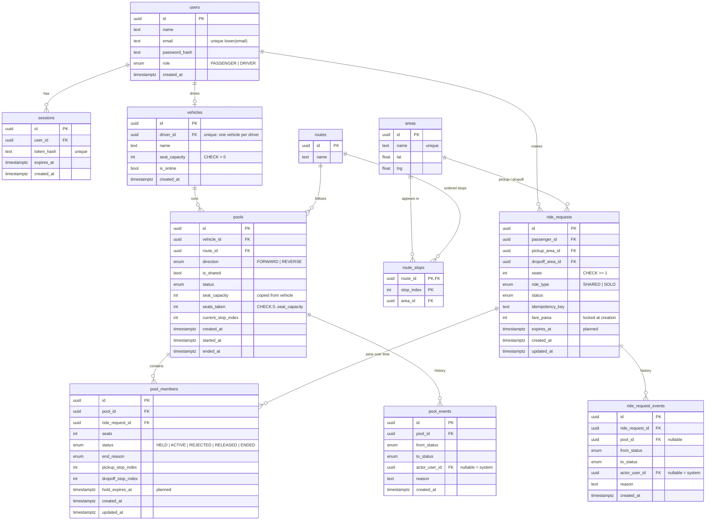

# Database Design (ERD)

PostgreSQL. Money is stored as integer paisa. Times are `timestamptz` (UTC). Primary keys are UUIDs.
Columns marked *(planned)* are added by their own migration when that feature is built.

## Tables

| Table | Why it exists |
|---|---|
| `users` | Passengers and drivers in one table with a `role`; both sign in the same way. |
| `sessions` | Server-side login sessions; only a SHA-256 hash of the token is stored; logout deletes the row. |
| `vehicles` | A driver's vehicle (Bullet, 3 seats). Also the **lock row** for all seat and pool changes. `is_online` lives here so availability changes under the same lock. |
| `areas` | Predefined Dhaka areas; lat/long are for display only. |
| `routes`, `route_stops` | Ordered stops per route; adjacent stops are one hop (2 km). Direction comes from index order. |
| `ride_requests` | One passenger's request and its lifecycle. The fare is calculated and locked here at creation. |
| `pools` | One trip of one vehicle along one route and direction. Holds the seat counter that the CHECK constraint protects. |
| `pool_members` | Which request is (or was) in which pool, with the seats taken and pickup/dropoff stops. A request can have several rows over time (e.g. rejected, then accepted elsewhere). |
| `ride_request_events`, `pool_events` | Append-only status history, used to explain exactly what happened. Two tables instead of one polymorphic table, so each has a real foreign key. |

Not included on purpose: payments (cash only), ratings (optional in the PRD).

## Constraints and indexes

| Object | Definition | Protects |
|---|---|---|
| CHECK | `pools.seats_taken BETWEEN 0 AND seat_capacity` | I1 capacity |
| CHECK | `vehicles.seat_capacity > 0`, `ride_requests.seats >= 1` | valid data |
| CHECK | `ride_requests.pickup_area_id <> dropoff_area_id` | E5 |
| Unique | `lower(users.email)` | G12 duplicate sign-up |
| Unique | `vehicles.driver_id` | one vehicle per driver |
| Unique | `sessions.token_hash` | session lookup |
| Unique | `ride_requests(passenger_id, idempotency_key)` | E6 duplicate submit |
| Partial unique | `ride_requests(passenger_id) WHERE status IN (REQUESTED, HELD, MATCHED, IN_PROGRESS)` | I5 one active request |
| Partial unique | `pools(vehicle_id) WHERE status IN (ACCEPTED, DRIVER_ARRIVED, STARTED)` | I4 one active pool |
| Partial unique | `pool_members(ride_request_id) WHERE status IN (HELD, ACTIVE)` | I2 one active membership |
| Unique | `route_stops(route_id, area_id)` | an area appears once per route |
| Index | `ride_requests(status, created_at)` | driver's waiting-request list |
| Index | `pool_members(pool_id, status)` | pool passenger list |
| Index | `ride_request_events(ride_request_id, created_at)`, `pool_events(pool_id, created_at)` | history timelines |

CHECK constraints and partial unique indexes are not expressible in `schema.prisma`; they are written
in migration SQL and listed here so the schema is fully documented.
