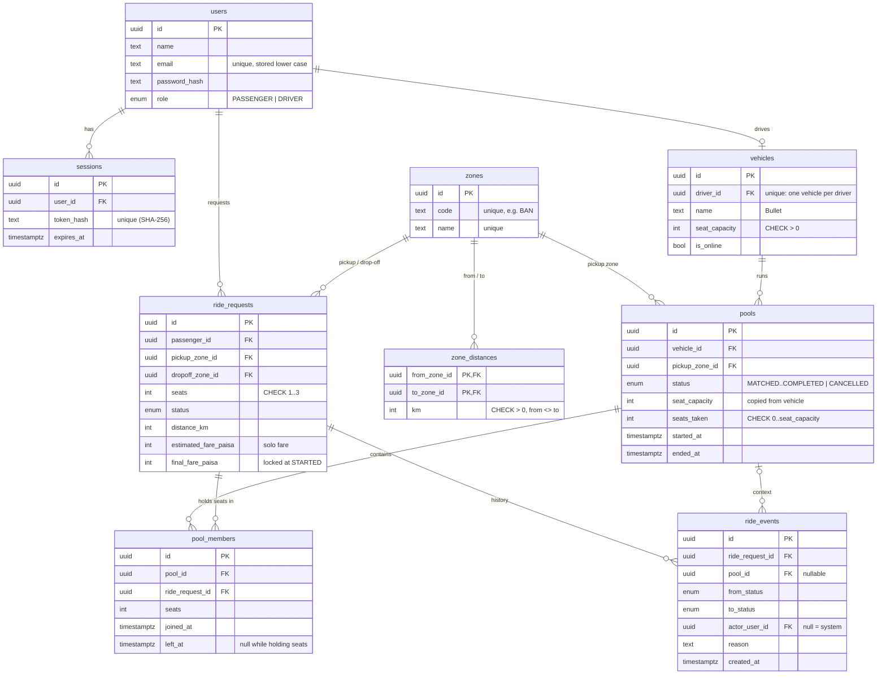

# Database Design (ERD)

PostgreSQL. Money is stored as integer paisa. Times are `timestamptz` (UTC). Primary keys are UUIDs.
Columns marked *(planned)* are added by their own migration when that feature is built.

## Tables

| Table | Why it exists |
|---|---|
| `users` | Passengers and drivers in one table with a `role`. |
| `sessions` | Server-side login sessions; only a SHA-256 hash of the token is stored. |
| `vehicles` | A driver's vehicle (Bullet, 3 seats). Its row is the **lock** for every seat change. `is_online` lives here so going online/offline uses the same lock. |
| `zones`, `zone_distances` | The 14 Dhaka zones and whole-km distances in both directions. |
| `pools` | One trip of one vehicle from one pickup zone. Holds the seat counter the CHECK protects. |
| `ride_requests` | One passenger's request: zones, seats, status, the solo estimate and the final fare. |
| `pool_members` | Pool membership: which request holds how many seats in which pool (`left_at` set on cancel). |
| `ride_events` | Append-only status history of every request (actor, reason, time). |

Not included on purpose: payments (cash only), ratings.

## Constraints and indexes

| Object | Definition | Protects |
|---|---|---|
| CHECK | `pools.seats_taken BETWEEN 0 AND seat_capacity` | capacity is never exceeded |
| CHECK | `pools.status <> 'REQUESTED'` | valid pool states |
| CHECK | `ride_requests.seats BETWEEN 1 AND 3`, `pickup_zone_id <> dropoff_zone_id`, fares ≥ 0 | valid requests |
| CHECK | `vehicles.seat_capacity > 0`, `zone_distances.km > 0`, `from <> to` | valid data |
| Unique + CHECK | `users.email` unique, `CHECK (email = lower(email))` | one account per email |
| Unique | `vehicles.driver_id` | one vehicle per driver |
| Partial unique | `pools(vehicle_id) WHERE status IN (MATCHED, DRIVER_ARRIVED, STARTED)` | one active pool per vehicle |
| Partial unique | `ride_requests(passenger_id) WHERE status IN (REQUESTED, MATCHED, DRIVER_ARRIVED, STARTED)` | one active ride per passenger |
| Partial unique | `pool_members(ride_request_id) WHERE left_at IS NULL` | a request is in at most one pool |
| Index | `ride_requests(status, created_at)`, `pools(status, pickup_zone_id)`, `ride_events(ride_request_id, created_at)` | driver list, auto-join lookup, history |

CHECK constraints and partial unique indexes are written by hand in migration SQL (Prisma's schema language cannot express them) and listed here so the schema is fully documented.
