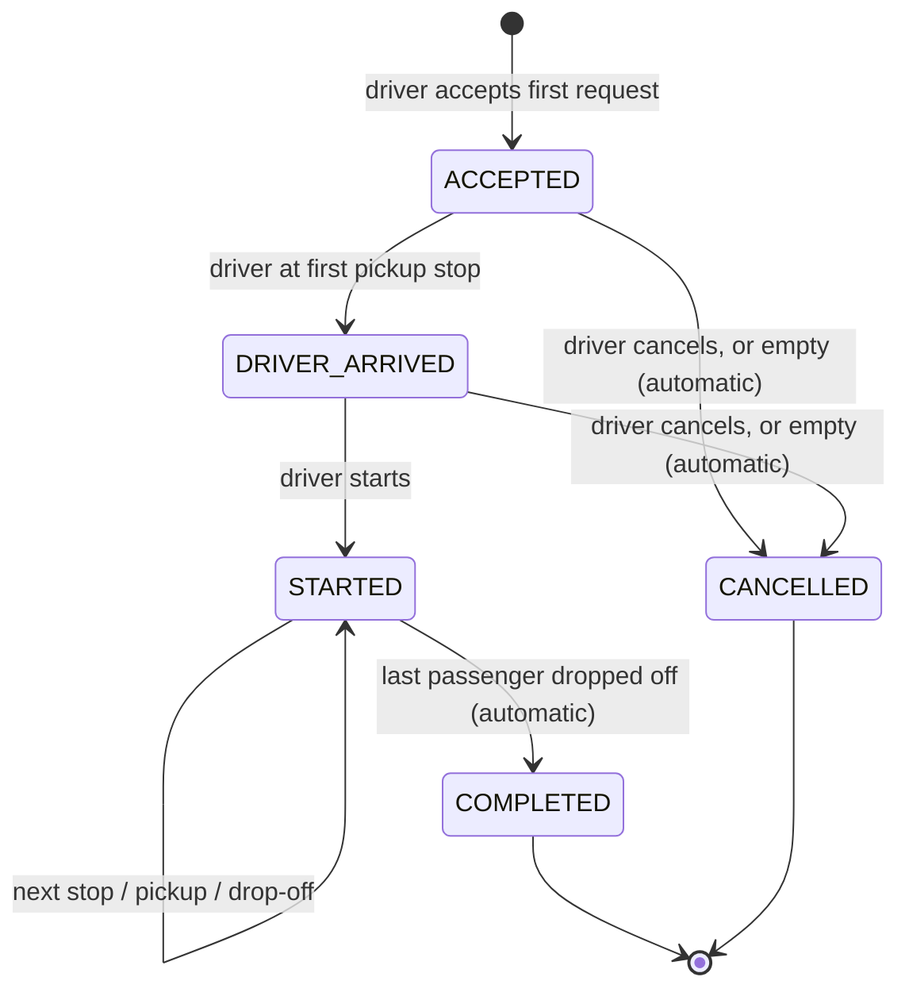
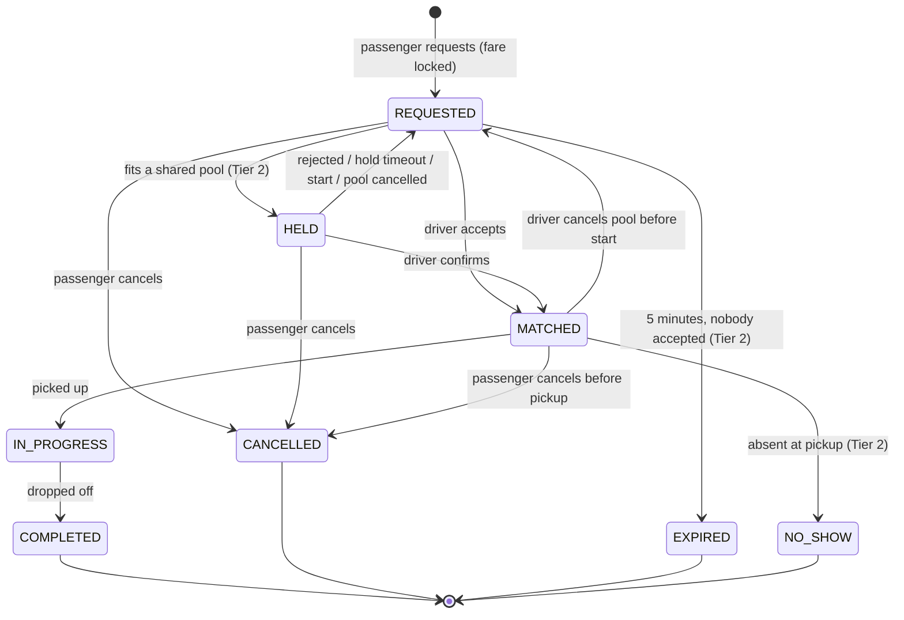
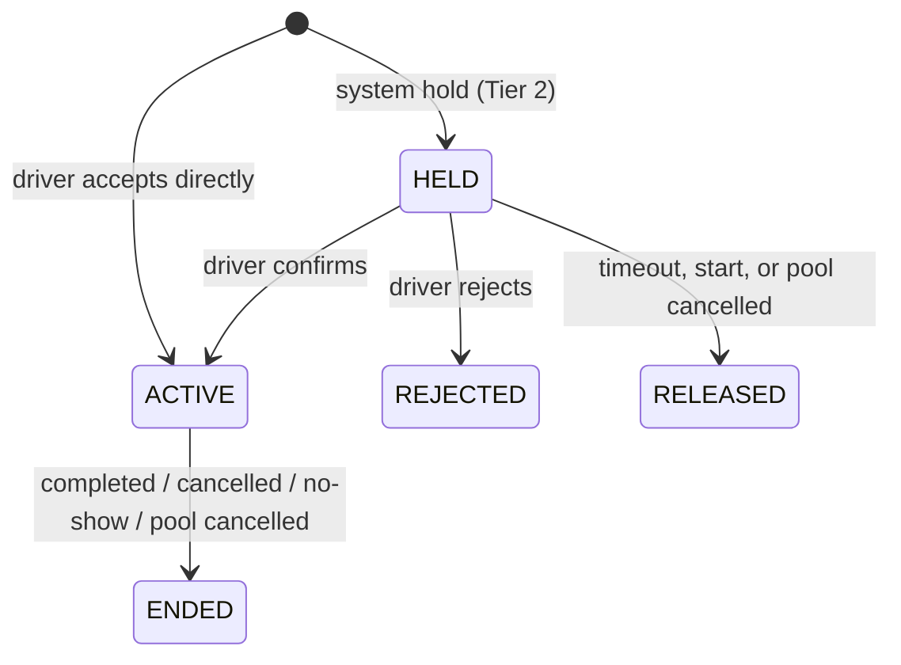

# State Machines

Any transition not listed here is rejected with `InvalidTransition`. Every transition writes an event row
(`pool_events` or `ride_request_events`) in the same transaction.

## Pool

| State | Joins allowed? |
|---|---|
| ACCEPTED, DRIVER_ARRIVED | Yes, if shared, on the same route and direction, seats free |
| STARTED | Only for pickups ahead of `current_stop_index`, if shared and seats free |
| COMPLETED, CANCELLED | No |

**Start requires:** at least one passenger IN_PROGRESS and no MATCHED passenger still waiting at the
current stop. Unconfirmed holds are released on start.

## Ride request (passenger)

Passenger-facing labels: **waiting** (REQUESTED, HELD) · **matched** (MATCHED) · **in progress**
(IN_PROGRESS) · **completed** · **cancelled** · **expired** · **no-show**.

A request returned to REQUESTED gets a fresh expiry time. Its locked fare does not change.

## Pool membership

Seats count toward `pools.seats_taken` while a membership is HELD or ACTIVE.

## Driver availability

`vehicles.is_online`: OFFLINE ⇄ ONLINE. Going offline is rejected while the vehicle has an active pool.
Changes take the vehicle lock.
