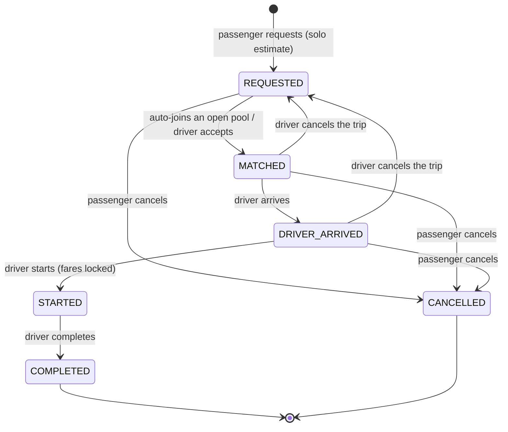
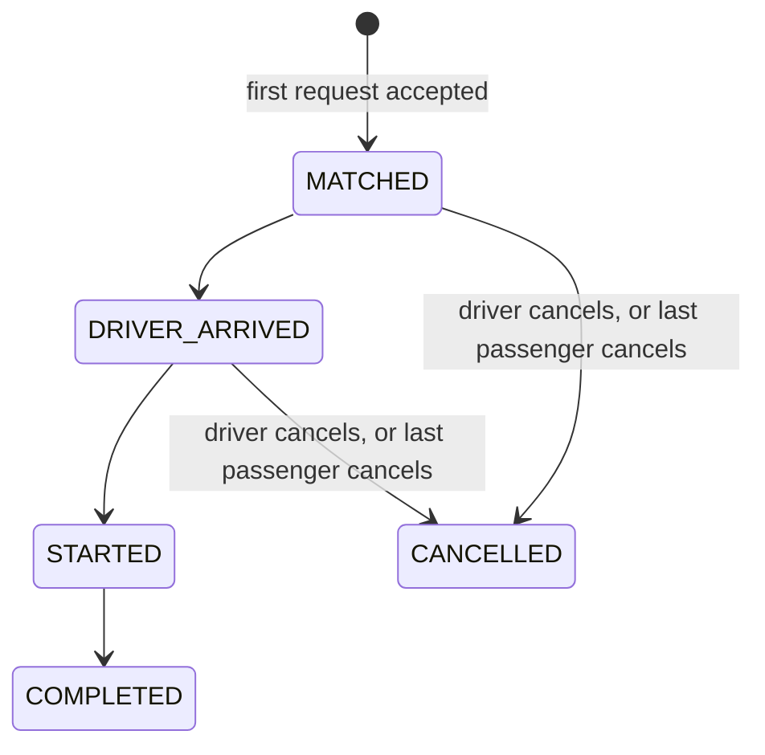

# State Machines

One status set is shared by pools and ride requests (docs/assumptions.md §5). Driver actions change the
pool and every active passenger in it in the same transaction, under the vehicle lock.
Any transition not listed here is rejected with **409 `INVALID_TRANSITION`**. Every change writes a
`ride_events` row (actor, reason, time).

## Ride request

| From | To | Actor | Precondition |
|---|---|---|---|
| REQUESTED | MATCHED | System / driver | Passes M1–M4 (same pickup, pool open, seats free, detour ≤ 2 km) |
| MATCHED | DRIVER_ARRIVED | Driver | Own vehicle's pool |
| DRIVER_ARRIVED | STARTED | Driver | ≥ 1 passenger; final fares locked (−20% if 2+ passengers) |
| STARTED | COMPLETED | Driver | — |
| REQUESTED, MATCHED, DRIVER_ARRIVED | CANCELLED | Passenger | Own ride (else 403); seats freed at once |
| MATCHED, DRIVER_ARRIVED | REQUESTED | Driver | Trip not started; passengers wait for another driver |

## Pool

Only a `MATCHED` pool accepts new passengers. Once the driver arrives, the group is fixed.

## Driver availability

`vehicles.is_online`. Going offline is refused while the vehicle has an active pool; accepting is
refused while offline. Both use the vehicle lock.
